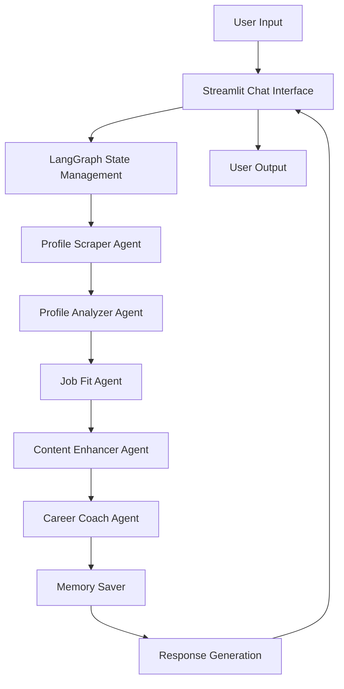

# 🤖 AI-Powered LinkedIn Career Coach

This project is a sophisticated, AI-powered career coaching chat system built with Python, Streamlit, and LangGraph. It provides personalized career advice by analyzing a user's LinkedIn profile against a target job description.

For a deep dive into the project's architecture, challenges, and solutions, please see the full **[Project Documentation](DOCUMENTATION.md)**.

## 🌟 Key Features

-   **Multi-Agent Architecture**: Uses specialized AI agents for tasks like intent classification, profile analysis, and job fit evaluation.
-   **Interactive Chat UI**: A user-friendly, real-time chat interface built with Streamlit.
-   **Dynamic Routing**: Employs LangGraph to manage the conversation and route user queries to the most appropriate AI agent.
-   **Efficient, One-Time Scraping**: Scrapes the user's public LinkedIn profile once per session for use as a persistent context.

---

## 🔧 Setup and Installation

Follow these steps to set up and run the project locally.

### Prerequisites

-   Python 3.8+
-   An OpenAI API Key

### Installation Steps

1.  **Clone the repository:**
    ```bash
    git clone <your-repo-url>
    cd linkedin_career_coach
    ```

2.  **Create and activate a virtual environment:**
    ```bash
    # For Windows
    python -m venv env
    .\env\Scripts\activate

    # For macOS/Linux
    python3 -m venv env
    source env/bin/activate
    ```

3.  **Install the required dependencies:**
    ```bash
    pip install -r requirements.txt
    ```

4.  **Set up your environment variables:**
    -   Create a new file named `.env` in the root of the project directory.
    -   Add your OpenAI API key to the file:
        ```
        OPENAI_API_KEY="your-openai-api-key-here"
        ```

### How to Run the Application

With your virtual environment activated, run the following command in your terminal:

```bash
streamlit run app.py
```

The application will open in your default web browser.

---

## 📂 Project Structure

-   `app.py`: The main Streamlit application file.
-   `graph.py`: Defines the LangGraph multi-agent structure.
-   `routing.py`: Contains the core routing logic for the graph.
-   `DOCUMENTATION.md`: Contains detailed documentation about the project's architecture and development.
-   `agents/`: Contains all the specialized AI agents.
-   `scraper/`: Contains the simple LinkedIn scraping utility.
-   `requirements.txt`: Lists all Python dependencies.

---

## 🎯 Key Features

### 1. **Interactive Chat Interface**
- 💬 **Natural Language Interaction**: Ask questions in plain English
- 🧠 **Context-Aware Responses**: System remembers conversation history
- 🎨 **Modern UI**: Clean, intuitive Streamlit interface with chat bubbles
- ⚡ **Real-time Responses**: Instant AI-powered career advice

### 2. **Comprehensive Profile Analysis**
- 📊 **LinkedIn Profile Scraping**: Automatic data extraction via Apify
- 🔍 **Multi-Section Analysis**: About, Experience, Skills, Education
- 📈 **Strengths & Weaknesses**: Detailed profile assessment
- 🎯 **Gap Identification**: Areas for improvement and enhancement

### 3. **Job Fit Analysis**
- 🎯 **Match Scoring**: Quantitative fit assessment for target roles
- 📋 **Requirement Comparison**: Profile vs. job description analysis
- 🚀 **Improvement Suggestions**: Specific recommendations for better fit
- 📊 **Visual Feedback**: Clear scoring and breakdown

### 4. **Content Enhancement**
- ✨ **AI-Powered Rewriting**: Improved profile sections
- 📝 **ATS Optimization**: Applicant Tracking System friendly content
- 🎨 **Professional Tone**: Industry-standard language and formatting
- 🔄 **Multiple Versions**: Different approaches for various roles

### 5. **Career Guidance & Skill Gap Analysis**
- 🎓 **Learning Resources**: Specific courses, certifications, and tools
- 🛤️ **Career Paths**: Recommended trajectories based on goals
- 📚 **Skill Development**: Personalized learning roadmaps
- 💡 **Strategic Advice**: Long-term career planning guidance

### 6. **Memory System**
- 💾 **Session Persistence**: LangGraph checkpointer for state management
- 🔄 **Context Retention**: Remembers user preferences and conversation history
- 📱 **Cross-Session Memory**: Resume conversations across browser sessions
- 🧠 **Smart Context**: Intelligent conversation flow management

---

## 🏗️ Architecture



---

## 🚀 Getting Started

### Prerequisites
- Python 3.8+
- OpenAI API key
- Apify API token (free credits available)

### Installation

1. **Clone the repository**
   ```bash
   git clone <repository-url>
   cd linkedin_career_coach
   ```

2. **Install dependencies**
   ```bash
   pip install -r requirements.txt
   ```

3. **Configure environment variables**
   Create a `.env` file:
   ```env
   OPENAI_API_KEY=your_openai_api_key_here
   APIFY_API_TOKEN=your_apify_token_here
   ```

4. **Run the application**
   ```bash
   streamlit run app.py
   ```

---

## 💬 How to Use

### 1. **Initial Setup**
- Enter your LinkedIn profile URL (must be public)
- Specify your target job title or description
- Click "Load Profile & Start Chat"

### 2. **Interactive Chat**
Once your profile is loaded, you can ask questions like:

**Profile Analysis:**
- "What are my profile's biggest strengths?"
- "Which sections need the most improvement?"
- "How does my experience section look?"

**Job Fit Analysis:**
- "How well do I match the job requirements?"
- "What's my fit score for this role?"
- "What skills am I missing for this position?"

**Content Enhancement:**
- "Can you rewrite my about section?"
- "Improve my headline for this job"
- "Make my experience descriptions more impactful"

**Career Guidance:**
- "What career path should I consider?"
- "What skills should I develop next?"
- "How can I transition to this field?"

### 3. **Follow-up Questions**
- Ask follow-up questions based on previous responses
- The system maintains context throughout the conversation
- Get deeper insights on specific areas

---

## 🛠️ Technical Implementation

### Multi-Agent Architecture
- **Profile Analyzer Agent**: Extracts and evaluates profile sections
- **Job Fit Agent**: Compares profile with job requirements
- **Content Enhancer Agent**: Generates improved profile content
- **Career Coach Agent**: Provides guidance and answers questions

### Memory System
- **LangGraph Checkpointer**: Persistent session state management
- **Chat History**: Context-aware conversation flow
- **State Management**: Structured data flow between agents

### Error Handling
- **Graceful Degradation**: Handles API failures and invalid inputs
- **User-Friendly Messages**: Clear error explanations
- **Logging**: Comprehensive error tracking and debugging

---

## 📁 Project Structure
```
linkedin_career_coach/
├── app.py                 # Main Streamlit application
├── graph.py              # LangGraph configuration
├── routing.py            # Agent routing logic
├── state.py              # State management
├── agents/               # Multi-agent system
│   ├── profile_analyzer_agent.py
│   ├── job_fit_agent.py
│   ├── content_enhancer_agent.py
│   └── career_coach_agent.py
├── scraper/              # LinkedIn data extraction
│   └── linkedin_scraper.py
├── logs/                 # Application logs
├── requirements.txt      # Python dependencies
└── README.md            # README
```

---

## 🔧 Configuration

### Environment Variables
- `OPENAI_API_KEY`: Your OpenAI API key for gpt-3.5-turbo access
- `APIFY_API_TOKEN`: Apify token for LinkedIn scraping

### Customization
- **Agent Prompts**: Modify agent prompts in individual agent files
- **UI Styling**: Customize Streamlit interface in `app.py`
- **Routing Logic**: Adjust agent flow in `routing.py`

---

## 🚀 Deployment

### Local Development
```bash
streamlit run app.py
```

### Cloud Deployment
The application can be deployed on:
- **Streamlit Cloud**: Direct deployment from GitHub
- **Heroku**: With Procfile configuration
- **AWS/GCP**: Container-based deployment

---

## 📊 Performance & Scalability

- **Response Time**: Typically 2-5 seconds per query
- **Memory Usage**: Efficient state management with LangGraph
- **Scalability**: Stateless agent design for horizontal scaling
- **Caching**: Intelligent response caching for common queries

---

## 🔒 Security & Privacy

- **API Key Security**: Environment variable protection
- **Data Privacy**: No persistent storage of sensitive profile data
- **Input Validation**: Comprehensive URL and input sanitization
- **Error Logging**: Secure error handling without data exposure

---

## 🤝 Contributing

1. Fork the repository
2. Create a feature branch
3. Make your changes
4. Add tests if applicable
5. Submit a pull request

---

## 📝 License

MIT License - see LICENSE file for details

---

## 🆘 Support

For issues and questions:
1. Check the logs in `logs/app.log`
2. Review the documentation
3. Open an issue on GitHub

---

**Built with ❤️ using LangGraph, Streamlit, and OpenAI** 